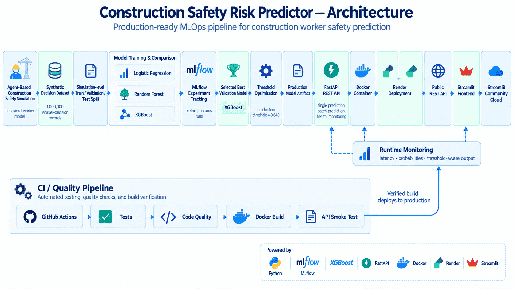

# Construction Safety Risk Predictor

[](https://github.com/Hickmanda/safety-risk-predictor/actions/workflows/tests.yml)


**Author:** [Daniil Marchici](https://github.com/Hickmanda)
**GitHub:** [@Hickmanda](https://github.com/Hickmanda)
**Repository:** [Hickmanda/safety-risk-predictor](https://github.com/Hickmanda/safety-risk-predictor)
**Version:** `1.0.1`

An end-to-end **machine-learning and MLOps project** for predicting
construction worker safety behavior from data generated by a stochastic
agent-based simulation.

The project connects:

**Agent-Based Simulation → Synthetic Dataset → Machine Learning → MLflow → FastAPI → Docker → Render → Streamlit**

into one reproducible end-to-end pipeline.

The final machine-learning model acts as a **surrogate model** of the
original agent-based construction-safety simulation.

---

## Live Project

| Resource | Link |
|---|---|
| **Interactive Web Application** | https://safety-risk-predictor.streamlit.app |
| **Production REST API** | https://safety-risk-predictor-api.onrender.com |
| **Swagger / OpenAPI Documentation** | https://safety-risk-predictor-api.onrender.com/docs |
| **API Health Check** | https://safety-risk-predictor-api.onrender.com/health |
| **Source Agent-Based Simulation** | https://github.com/Hickmanda/abm-construction-safety |

> **Note:** The API is deployed on a free Render instance and may require
> a short cold-start period after inactivity.

---

## Project Overview

Construction-safety behavior is influenced by multiple interacting
psychological, social, and decision-making factors.

Instead of starting from a conventional static tabular dataset, this
project generates training data from an existing **agent-based model of
construction worker safety behavior**.

The complete workflow contains four major stages:

1. Run multiple independent agent-based simulations.
2. Convert simulated worker decisions into a machine-learning dataset.
3. Train, validate, compare, and select supervised classification models.
4. Deploy the selected model through a production API and interactive
   web interface.

The project therefore demonstrates not only model training, but the
complete lifecycle required to move an ML experiment into a
**reproducible, tested, containerized, monitored, and publicly accessible
software system**.

---

## System Architecture



The deployed architecture separates simulation, model training, model
serving, and presentation responsibilities.

```text
Agent-Based Construction Safety Simulation
                    |
                    v
         Synthetic Data Generation
                    |
                    v
          1,000,000 Decisions
                    |
                    v
       Simulation-Level Data Split
                    |
          +---------+---------+
          |         |         |
          v         v         v
       Train    Validation    Test
          |
          v
  Logistic Regression
  Random Forest
  XGBoost
          |
          v
     MLflow Tracking
          |
          v
    Model Selection
          |
          v
 Threshold Optimization
          |
          v
  Production Model Artifact
          |
          v
        FastAPI
          |
          v
         Docker
          |
          v
         Render
          |
          v
     Public REST API
          |
          v
  Streamlit Frontend
          |
          v
 Streamlit Community Cloud
```

The production Streamlit application does **not** load the model
artifact directly.

Instead:

```text
User
  |
  v
Streamlit UI
  |
  | HTTPS / JSON
  v
FastAPI REST API
  |
  v
Production XGBoost Model
  |
  v
Prediction Response
```

This provides a clear separation between the **presentation layer** and
the **model-serving layer**.

For a detailed description, see
[`docs/ARCHITECTURE.md`](docs/ARCHITECTURE.md).

---

## Dataset Generation

The dataset is generated by repeatedly executing the agent-based model
with different simulation seeds.

Each complete data-generation experiment uses:

```text
100 independent simulation runs
100 workers per run
100 simulated days per run
```

Therefore:

```text
100 × 100 × 100 = 1,000,000 worker-decision records
```

Each record represents a worker state and the corresponding simulated
safety decision.

This approach creates a large controlled dataset while preserving the
stochastic behavior of the original agent-based simulation.

The source simulation is available separately:

https://github.com/Hickmanda/abm-construction-safety

---

## Input Features

The production model uses **11 features** derived from the
agent-based behavioral simulation.

| Feature | Description |
|---|---|
| `SA` | Situational Awareness |
| `SK` | Safety Knowledge |
| `SN` | Subjective Norm |
| `BA` | Behavioral Attitude |
| `PBC` | Perceived Behavioral Control |
| `reference_point` | Reference point used by the behavioral decision model |
| `alpha` | CPT model parameter |
| `beta` | CPT model parameter |
| `lam` | Loss-aversion parameter |
| `intention` | Calculated behavioral intention |
| `day` | Simulation day |

The `intention` feature represents the worker's behavioral intention in
the source simulation.

In the interactive application it is derived from:

```text
intention = (SN + BA + PBC) / 3
```

---

## Machine-Learning Pipeline

Three supervised classification approaches were evaluated:

- Logistic Regression
- Random Forest
- XGBoost

The modeling workflow follows:

```text
Generated simulations
        |
        v
Simulation-level split
        |
        +---- Train
        |
        +---- Validation
        |
        +---- Test
        |
        v
Model training
        |
        v
Model comparison
        |
        v
Validation model selection
        |
        v
Threshold optimization
        |
        v
Held-out test evaluation
        |
        v
Production artifact
```

A key methodological decision is that splitting is performed at the
**simulation-run level**, rather than randomly splitting individual
rows.

This reduces information leakage between observations generated within
the same simulated trajectory.

---

## MLflow Experiment Tracking

Model experiments are tracked using **MLflow**.

The experiment-tracking stage records information such as:

- model family;
- model parameters;
- validation metrics;
- experiment runs;
- model-selection results;
- production candidate information.

This makes model comparison reproducible and provides a clear record of
the experimental process.

---

## Key Results

The complete generated dataset contains:

**1,000,000 worker-decision records**

generated from:

- **100 independent simulation runs**
- **100 workers per run**
- **100 simulated days per run**

Three supervised classification models were evaluated using a
**simulation-level train / validation / test split**.

### Validation Performance

| Model | Validation Macro F1 |
|---|---:|
| Logistic Regression | 0.6074 |
| Random Forest | 0.6114 |
| **XGBoost** | **0.6126** |

XGBoost achieved the highest validation Macro F1 and was therefore
selected as the production model.

### Held-out Test Performance

| Metric | Value |
|---|---:|
| Accuracy | 0.7578 |
| Balanced Accuracy | 0.6177 |
| Macro F1 | 0.6259 |
| Safe F1 | 0.8480 |
| Unsafe F1 | 0.4037 |
| ROC-AUC | 0.7235 |

The default classifier threshold of `0.50` was not used directly for
production.

Instead, the decision threshold was optimized using validation
simulations.

The selected production threshold is:

```text
P(safe) >= 0.640  -> SAFE
P(safe) <  0.640  -> UNSAFE
```

At the production threshold:

```text
Production threshold:             0.640
Production-threshold Test F1:     0.6652
Unsafe recall at threshold 0.640: 0.5011
```

This threshold is stored with the production model metadata and used by
the deployed API.

For the complete experimental analysis, see
[`docs/RESULTS.md`](docs/RESULTS.md).

---

## Interpretation of the Results

The agent-based simulation is **stochastic**.

This means that similar or even identical worker states do not
necessarily produce identical safety decisions every time.

Therefore, the machine-learning task contains an intrinsic source of
uncertainty.

The purpose of the surrogate model is not to perfectly memorize every
simulated decision. Instead, it attempts to learn the probabilistic
decision structure generated by the underlying behavioral simulation.

This distinction is important when interpreting classification
performance on synthetically generated stochastic labels.

---

## Production Model

The selected production model is:

```text
Model: XGBoost
Validation Macro F1: 0.6126
Production threshold: 0.640
Number of features: 11
Target: behavior
```

The selected production model is stored as a versioned model artifact:

```text
models/best_model.pkl
```

The model is loaded by the FastAPI service during application startup.

---

## Production REST API

The trained model is exposed through a **FastAPI REST API**.

Production endpoint:

https://safety-risk-predictor-api.onrender.com

Interactive OpenAPI documentation:

https://safety-risk-predictor-api.onrender.com/docs

### Available Endpoints

| Method | Endpoint | Purpose |
|---|---|---|
| `GET` | `/` | Service information |
| `GET` | `/health` | API and model health check |
| `GET` | `/model-info` | Production model metadata |
| `POST` | `/predict` | Worker-safety prediction |
| `GET` | `/metrics` | Lightweight runtime monitoring |

---

## API Example

### Request

```json
{
  "SA": 0.70,
  "SK": 0.75,
  "SN": 0.68,
  "BA": 0.72,
  "PBC": 0.70,
  "reference_point": 0.60,
  "alpha": 0.88,
  "beta": 0.88,
  "lam": 1.18,
  "day": 50
}
```

The API derives the required behavioral features and passes the final
feature vector to the production model.

### Example Response

```json
{
  "behavior": 1,
  "label": "safe",
  "safe_probability": 0.8418,
  "unsafe_probability": 0.1582,
  "decision_threshold": 0.64
}
```

A prediction is classified as `safe` only when:

```text
safe_probability >= production threshold
```

For detailed API documentation, see
[`docs/API.md`](docs/API.md).

---

## API Health Check

The deployed service exposes a health endpoint:

```text
GET /health
```

Example response:

```json
{
  "status": "ok",
  "model_loaded": true,
  "model_name": "xgboost",
  "detail": null
}
```

This confirms both:

- the API process is running;
- the production model artifact was loaded successfully.

---

## Model Metadata

Production model information is available through:

```text
GET /model-info
```

The endpoint exposes metadata including:

- model name;
- model-selection metric;
- validation score;
- production threshold;
- feature count;
- feature names;
- target variable;
- threshold objective.

This allows external clients to inspect the deployed model without
accessing the serialized artifact directly.

---

## Runtime Monitoring

The API includes a lightweight runtime monitoring endpoint:

```text
GET /metrics
```

The service tracks runtime information such as:

- total predictions;
- safe predictions;
- unsafe predictions;
- average API latency;
- application uptime.

This demonstrates basic production-inference observability without
requiring a separate monitoring platform.

---

## Interactive Streamlit Application

The public frontend is deployed with **Streamlit Community Cloud**:

https://safety-risk-predictor.streamlit.app


The interface provides four main sections:

### Single Prediction

Users can interactively configure worker-state variables and send a
prediction to the production API.

The interface displays:

- predicted class;
- safe probability;
- unsafe probability;
- production decision threshold;
- API latency.

### Batch Prediction

A CSV file containing multiple worker states can be uploaded.

The application:

1. validates the input;
2. submits predictions;
3. displays safe/unsafe counts;
4. creates a results table;
5. allows predictions to be downloaded as CSV.

### Monitoring

Runtime API metrics can be inspected directly from the frontend.

### Methodology

The application also explains the model, simulation source, feature
definitions, and production-threshold logic.

---

## Docker

The production API is containerized using **Docker**.

Build the image:

```bash
docker build -t safety-risk-predictor .
```

Run the container:

```bash
docker run --rm -p 8000:8000 safety-risk-predictor
```

Then open:

```text
http://127.0.0.1:8000
```

Swagger documentation:

```text
http://127.0.0.1:8000/docs
```

Health check:

```text
http://127.0.0.1:8000/health
```

The public Docker deployment is hosted on **Render**.

---

## Local Installation

Clone the repository:

```bash
git clone https://github.com/Hickmanda/safety-risk-predictor.git
cd safety-risk-predictor
```

Create a virtual environment:

```bash
python -m venv .venv
```

### Windows PowerShell

```powershell
.venv\Scripts\Activate.ps1
```

### Linux / macOS

```bash
source .venv/bin/activate
```

Install dependencies:

```bash
pip install -r requirements.txt
```

---

## Run the API Locally

Start the FastAPI backend:

```bash
uvicorn api.main:app --host 0.0.0.0 --port 8000
```

Open:

```text
http://127.0.0.1:8000/docs
```

Verify the service:

```text
http://127.0.0.1:8000/health
```

---

## Run the Streamlit Frontend Locally

With the API running, start the frontend:

```bash
streamlit run app.py
```

The application is normally available at:

```text
http://localhost:8501
```

---

## Testing

The project uses **pytest** for automated testing.

Run the test suite:

```bash
python -m pytest -q
```

Code-quality checks are performed with **flake8**:

```bash
flake8 src api tests app.py --count --select=E9,F63,F7,F82 --show-source --statistics
```

These checks are also executed through the GitHub Actions workflow.

---

## Continuous Integration

GitHub Actions provides automated CI validation for the repository.

The workflow includes:

```text
Source code
    |
    v
GitHub Actions
    |
    +--> Automated tests
    |
    +--> Code-quality checks
    |
    +--> Docker build
    |
    +--> API smoke test
```

The current CI status is displayed by the badge at the top of this
README.

This helps ensure that changes pushed to the repository do not silently
break the production pipeline.

---

## Technology Stack

| Area | Technology |
|---|---|
| Agent-Based Modeling | Mesa |
| Data Processing | Pandas, NumPy |
| Machine Learning | scikit-learn, XGBoost |
| Experiment Tracking | MLflow |
| API | FastAPI |
| Validation | Pydantic |
| API Server | Uvicorn |
| Frontend | Streamlit |
| Containerization | Docker |
| CI | GitHub Actions |
| API Deployment | Render |
| Frontend Deployment | Streamlit Community Cloud |
| Testing | pytest |
| Code Quality | flake8 |
| Version Control | Git / GitHub |

---

## Repository Structure

```text
safety-risk-predictor/
|
|-- .devcontainer/
|
|-- .github/
|   `-- workflows/
|       `-- tests.yml
|
|-- api/
|   `-- main.py
|
|-- data/
|   |-- sample_dataset.csv
|   `-- sample_batch.csv
|
|-- docs/
|   |-- API.md
|   |-- ARCHITECTURE.md
|   |-- METHODOLOGY.md
|   |-- RESULTS.md
|   |
|   `-- images/
|       |-- cover.png
|       |-- architecture.png
|       `-- streamlit-ui.png
|
|-- models/
|   `-- best_model.pkl
|
|-- reports/
|
|-- src/
|   |-- generate_data.py
|   |-- model.py
|   `-- ...
|
|-- tests/
|
|-- app.py
|-- Dockerfile
|-- requirements.txt
|-- requirements-api.txt
|-- pyproject.toml
|-- CITATION.cff
|-- LICENSE
`-- README.md
```

---

## Documentation

Detailed technical documentation is available in the `docs` directory.

| Document | Description |
|---|---|
| [`METHODOLOGY.md`](docs/METHODOLOGY.md) | Dataset generation, experimental methodology, data splitting, and model evaluation |
| [`RESULTS.md`](docs/RESULTS.md) | Experimental results, model comparison, threshold optimization, and final metrics |
| [`API.md`](docs/API.md) | REST API behavior, request/response structure, and deployment |
| [`ARCHITECTURE.md`](docs/ARCHITECTURE.md) | Complete system architecture and MLOps pipeline |

---

## Reproducibility

The project was designed so that the complete experimental workflow can
be reproduced from source code.

The repository provides:

- source simulation integration;
- deterministic simulation seeds;
- synthetic-data generation;
- simulation-level dataset splitting;
- model-training code;
- multiple-model comparison;
- validation-based model selection;
- validation-based threshold optimization;
- held-out test evaluation;
- MLflow experiment tracking;
- versioned production model artifact;
- automated tests;
- Docker configuration;
- public API deployment;
- public frontend deployment;
- methodology and results documentation.

Generated large datasets are intentionally excluded from Git where
appropriate, while small reproducible example datasets are retained.

---

## Why Simulation-Level Splitting Matters

Rows produced by one simulation run share the same simulated environment
and temporal trajectory.

A conventional random row-level split could therefore place highly
related observations into both training and evaluation datasets.

To reduce this form of information leakage, this project performs the
train / validation / test separation at the **simulation-run level**.

Conceptually:

```text
Simulation runs
      |
      +--> Training simulations
      |
      +--> Validation simulations
      |
      `--> Completely held-out test simulations
```

The production model is selected using validation simulations.

The final evaluation is performed on simulation runs not used for model
selection.

---

## Model Selection vs. Final Evaluation

The project deliberately separates model selection from final test
evaluation.

```text
Training set
    |
    v
Fit candidate models
    |
    v
Validation set
    |
    +--> Compare Logistic Regression
    +--> Compare Random Forest
    +--> Compare XGBoost
    |
    v
Select model
    |
    v
Optimize decision threshold
    |
    v
Held-out test set
    |
    v
Final evaluation
```

This prevents the held-out test set from becoming part of the
model-selection process.

---

## Project Scope

This project is primarily an **MLOps and machine-learning engineering
demonstration**.

It focuses on:

- transforming agent-based simulation output into ML training data;
- designing leakage-aware evaluation;
- comparing supervised-learning models;
- tracking experiments;
- optimizing a production classification threshold;
- packaging a model for inference;
- exposing inference through a REST API;
- containerizing the backend;
- adding automated testing and CI;
- deploying backend and frontend services;
- creating a public interactive demonstration.

It is intended as an educational and research software project and
should not be interpreted as a certified real-world occupational safety
decision system.

---

## Companion Project

The machine-learning dataset originates from the companion
agent-based simulation project:

**Agent-Based Simulation of Construction Worker Safety**

https://github.com/Hickmanda/abm-construction-safety

The two projects demonstrate a complete progression:

```text
Behavioral theory
      |
      v
Agent-Based Model
      |
      v
Synthetic Behavioral Data
      |
      v
Machine Learning
      |
      v
MLOps
      |
      v
Production API
      |
      v
Interactive Application
```

---

## Release

Current project version:

```text
v1.0.1
```

Release metadata is also defined in:

- `pyproject.toml`
- `CITATION.cff`
- GitHub Releases

---

## Citation

If you use this project for educational or research purposes, citation
metadata is provided in:

[`CITATION.cff`](CITATION.cff)

Recommended attribution:

```text
Marchici, Daniil. Construction Safety Risk Predictor.
Machine-learning and MLOps project for predicting construction worker
safety behavior from agent-based simulation data. Version 1.0.1, 2026.
```

GitHub can also generate citation information directly from the
repository's `CITATION.cff` file.

---

## Author

### Daniil Marchici

**Project author and developer**

- **GitHub:** [@Hickmanda](https://github.com/Hickmanda)
- **GitHub Profile:** https://github.com/Hickmanda
- **Repository:** https://github.com/Hickmanda/safety-risk-predictor
- **Live Application:** https://safety-risk-predictor.streamlit.app
- **Production REST API:** https://safety-risk-predictor-api.onrender.com
- **Swagger / OpenAPI:** https://safety-risk-predictor-api.onrender.com/docs
- **Companion ABM Project:** https://github.com/Hickmanda/abm-construction-safety

---

## License

This project is released under the **MIT License**.

```text
Copyright (c) 2026 Daniil Marchici
```

See [`LICENSE`](LICENSE) for the full license text.

---

**Construction Safety Risk Predictor — Daniil Marchici, 2026**
