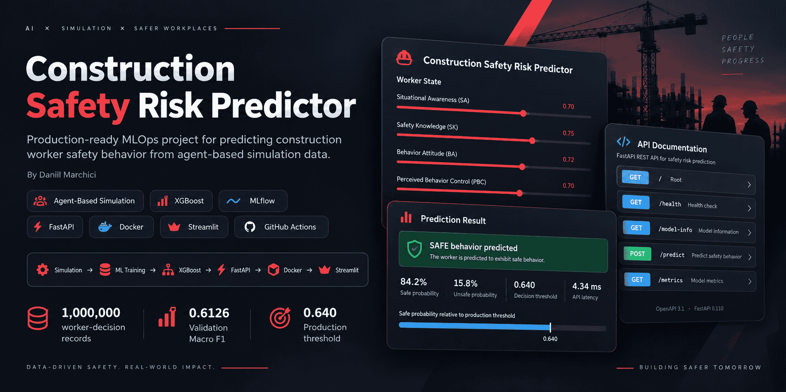
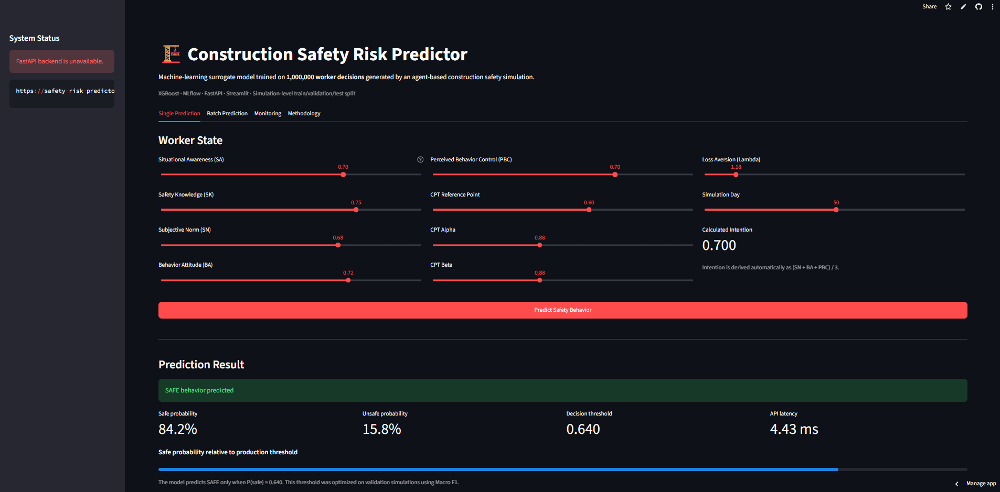

# Construction Safety Risk Predictor

[](https://github.com/Hickmanda/safety-risk-predictor/actions/workflows/tests.yml)




**Author:** [Daniil Marchici](https://github.com/Hickmanda)
**GitHub:** [@Hickmanda](https://github.com/Hickmanda)
**Repository:** [Hickmanda/safety-risk-predictor](https://github.com/Hickmanda/safety-risk-predictor)

An end-to-end **machine-learning and MLOps project** for predicting
construction worker safety behavior from data generated by a stochastic
agent-based simulation.

The project connects:

**Agent-Based Simulation → Synthetic Dataset → Machine Learning → MLflow → FastAPI → Docker → Render → Streamlit**

into one reproducible end-to-end pipeline.

The final machine-learning model acts as a **surrogate model** of the
original agent-based construction-safety simulation.

---

## Live Project

| Resource | Link |
|---|---|
| **Interactive Web Application** | https://safety-risk-predictor.streamlit.app |
| **Production REST API** | https://safety-risk-predictor-api.onrender.com |
| **Swagger / OpenAPI Documentation** | https://safety-risk-predictor-api.onrender.com/docs |
| **API Health Check** | https://safety-risk-predictor-api.onrender.com/health |
| **Source Agent-Based Simulation** | https://github.com/Hickmanda/abm-construction-safety |

> **Note:** The API is deployed on a free Render instance and may require
> a short cold-start period after inactivity.

---

## Live Application

The public Streamlit application provides an interactive interface for
the deployed machine-learning model.

Users can:

- configure worker-state parameters;
- request safety predictions from the production API;
- inspect safe and unsafe probabilities;
- perform batch predictions from CSV files;
- view model metadata;
- inspect runtime monitoring information;
- review the project methodology.



The Streamlit frontend communicates with the deployed FastAPI backend
rather than loading the production model directly inside the frontend.

This separates the **presentation layer** from the **model-serving layer**
and reflects a service-oriented production architecture.

---

## Key Results

The complete generated dataset contains:

**1,000,000 worker-decision records**

generated from:

- **100 independent simulation runs**
- **100 workers per run**
- **100 simulated days per run**

Three supervised classification models were evaluated using a
**simulation-level train / validation / test split**.

| Model | Validation Macro F1 |
|---|---:|
| Logistic Regression | 0.6074 |
| Random Forest | 0.6114 |
| **XGBoost** | **0.6126** |

XGBoost achieved the highest validation Macro F1 and was therefore
selected as the production model.

### Held-out Test Performance

| Metric | Value |
|---|---:|
| Accuracy | 0.7578 |
| Balanced Accuracy | 0.6177 |
| Macro F1 | 0.6259 |
| Safe F1 | 0.8480 |
| Unsafe F1 | 0.4037 |
| ROC-AUC | 0.7235 |

The default classifier threshold of `0.50` was not used directly for
production.

Instead, the decision threshold was optimized using validation
simulations.

The selected production threshold is:

```text
P(safe) >= 0.640  -> SAFE
P(safe) <  0.640  -> UNSAFE
